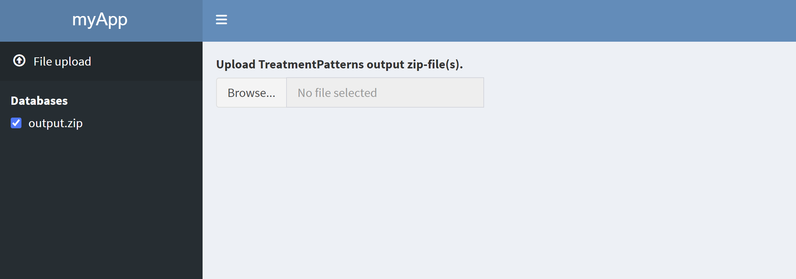

`TreatmentPatterns` provides several [shiny modules](https://mastering-shiny.org/scaling-modules.html). Shiny modules allow to quickly build a shiny app, based on pre-written code. In `TreatmentPatterns` there are 3 modules availible: **1**) `InputHandler`, **2**) `InteractivePlots`, and **3**) `CharacterizationPlots`. These modules are represented as `R6` classes.

## Generic interface
Each module as 3 methods that represent the main interface on how to utilize them: **1**) `uiBody`, **2**) `uiMenu`, **3**) `server`.

### uiBody
The `uiBody()` method calls for the body of the module, which can be used inside a layout like `fluidPage()` from the `shiny` package or `dashboardPage()` from the `shinydashboard` package.

### uiMenu
The `uiMenu()` method calls for a menu link which points toward the page generated by `uiBody()`. This is typically used with `shinydashboard`'s `dashboardPage()`.

### server
The `server()` method calls the back-end of the module, which handles all the internal computations, data filtering, and file management.

## InputHandler
The `InputHandler` module has some key methods that can be used to setup your TreatmentPatterns shiny application quickly. First we need to create an object of the class `InputHandler` which we do like so:
```{r InputHandler, warning=FALSE, message=FALSE}
library(TreatmentPatterns)

inputHandler <- InputHandler$new("app")
```

Now that our `InputHandler` is initialized and ready to go, we have access to the `uiBody()` and `uiMenu()` methods to build our UI with. In this example the `uiMenu()` is wrapped inside `sidebarMenu()` and `dashboardSidebar()`. The `uiBody()` method is wrapped inside `tabItems()` and `dashboardBody()`.
```{r InputHandler_UI}
library(shiny)
library(shinydashboard)

inputHandler <- InputHandler$new("app")

ui <- dashboardPage(
  header = dashboardHeader(title = "myApp"),
  sidebar = dashboardSidebar(sidebarMenu(
    # InputHandler menu item
    inputHandler$uiMenu(),
    
    # Database Selection
    inputHandler$uiDatabaseSelector()
  )),
  body = dashboardBody(tabItems(
    # InputHandler body
    inputHandler$uiBody()
  ))
)
```

We also have access to the `setDataPath()` and `server()` methods. The `setDataPath()` method allows us to specify either a path to a zip-file, or pass the input from our server function.

When we set the `path` parameter instead, the input becomes static. Note, that this also renders the `uiBody()` and `uiMenu()` methods redundant.
```{r InputHandler_server_static}
server <- function(input, output, session) {
  shiny::moduleServer("app", function(input, output, session) {
    # Set static path
    inputHandler$setDataPath(path = system.file(package = "TreatmentPatterns", "DummyOutput", "output.zip"))
    # Run server back-end
    inputHandler$server(input, output, session)
  })
}
```

```{r InputHandler_app, eval=FALSE}
shinyApp(ui, server)
```


If we pass the input, the user can interactively upload a zip file.
```{r InputHandler_server_interactive}
# Data uploaded by user
server <- function(input, output, session) {
  shiny::moduleServer("app", function(input, output, session) {
    # Set input, for interactive file upload
    inputHandler$setDataPath(input = input)
    # InputHandler back-end
    inputHandler$server(input, output, session)
  })
}
```

## InteractivePlots
Lets first create an `InteractivePlots` module object.
```{r InteractivePlots}
interactivePlots <- InteractivePlots$new("app")
```

We can now add our UI by calling the `uiMenu()` and `uiBody()` methods.
```{r InteractivePlots_UI}
ui <- dashboardPage(
  header = dashboardHeader(title = "myApp"),
  sidebar = dashboardSidebar(sidebarMenu(
    # InputHandler menu item
    inputHandler$uiMenu(),
    
    # InteractivePlots menu item
    interactivePlots$uiMenu(),
    
    # Database Selection
    inputHandler$uiDatabaseSelector()
  )),
  body = dashboardBody(tabItems(
    # InputHandler body
    inputHandler$uiBody(),
    
    # InteractivePlots body
    interactivePlots$uiBody()
  ))
)
```

Finally we can add our server back-end to the server function. **Note that the `server()` method for `InteractivePlots` also takes the inputHandler module object as an input.**
```{r InteractivePlots_server}
server <- function(input, output, session) {
  shiny::moduleServer("app", function(input, output, session) {
    # Set input, for interactive file upload
    inputHandler$setDataPath(path = system.file(package = "TreatmentPatterns", "DummyOutput", "output.zip"))
    # InputHandler back-end
    inputHandler$server(input, output, session)
    
    # InteracitvePlots back-end
    interactivePlots$server(input, output, session, inputHandler)
  })
}
```

```{r InteractivePlots_app, eval=FALSE}
shinyApp(ui, server)
```


## CharacterizationPlots
Lets first create an `CharacterizationPlots` module object.
```{r CharacterizationPlots, eval=FALSE}
characterizationPlots <- CharacterizationPlots$new("app")
```

We can now add our UI by calling the `uiMenu()` and `uiBody()` methods.
```{r CharacterizationPlots_UI, eval=FALSE}
ui <- dashboardPage(
  header = dashboardHeader(title = "myApp"),
  sidebar = dashboardSidebar(sidebarMenu(
    # InputHandler menu item
    inputHandler$uiMenu(),
    
    # InteractivePlots menu item
    interactivePlots$uiMenu(),
    
    # CharacterizationPlots menu item
    characterizationPlots$uiMenu(),
    
    # Database Selection
    inputHandler$uiDatabaseSelector()
  )),
  body = dashboardBody(tabItems(
    # InputHandler body
    inputHandler$uiBody(),
    
    # InteractivePlots body
    interactivePlots$uiBody(),
    
    # CharacterizationPlots body
    characterizationPlots$uiBody()
  ))
)
```

Finally we can add our server back-end to the server function. **Note that the `server()` method for `InteractivePlots` also takes the inputHandler module object as an input.**
```{r CharacterizationPlots_server, eval=FALSE}
server <- function(input, output, session) {
  shiny::moduleServer("app", function(input, output, session) {
    # Set input, for interactive file upload
    inputHandler$setDataPath(path = system.file(package = "TreatmentPatterns", "DummyOutput", "output.zip"))
    # InputHandler back-end
    inputHandler$server(input, output, session)
    
    # InteractivePlots back-end
    interactivePlots$server(input, output, session, inputHandler)
    
    # CharacterizationPlots back-end
    characterizationPlots$server(input, output, session, inputHandler)
  })
}
```

```{r CharacterizationPlots_app, eval=FALSE}
shinyApp(ui, server)
```

